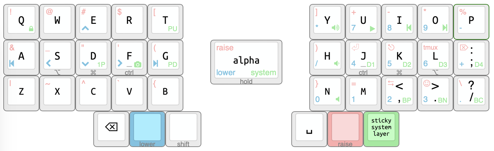

# My keyboard layout

## Overview

A 36 keys split keyboard layout implemented with [ZMK](https://zmk.dev/).

The layout is designed for a keyboard with 3x5 main keys plus 3 thumb keys per split
(e.g. [Corne Keyboard](https://github.com/foostan/crkbd)) and optimized to use VIM and tmux in macOS.

## Layout

The layout design tries to adhere to the following concepts as much as possible:

- Familiarity with a standard keyboard
- Avoid complexity as much as possible
- Ergonomic design
- Wireless ready

### Legend

- PU/PD: Page Up/Page Down
- 1P: 1Password
- D1/D2/D3/D4: macOS shortcuts for navigating virtual desktops
- BP/BN/BC: Bluetooth Previous/Next/Clear
- tmux: Ctrl + B (tmux shortcut)

## References

Most of the concepts used in this layout can be found in [rafaelromao](https://github.com/rafaelromao/keyboards)'s repo.

## Resources

- [ZMK](https://zmk.dev/docs)
- [Keyboard Layout Editor](http://www.keyboard-layout-editor.com/#/gists/6bf91d85dfb6f360b1dd5082e9c93135)
